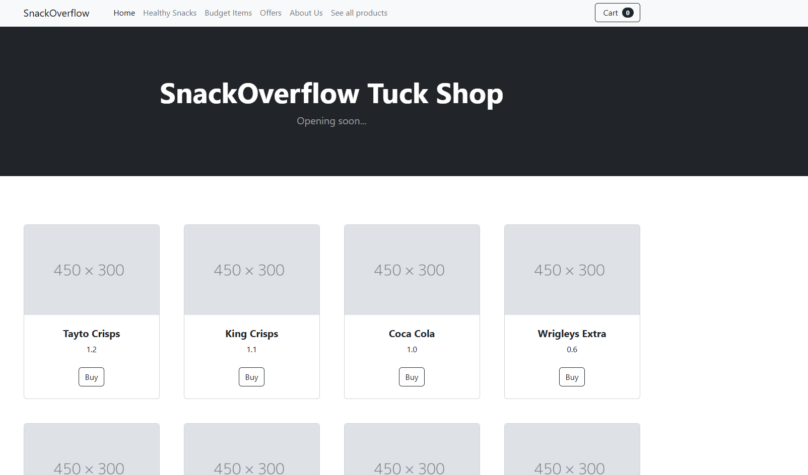
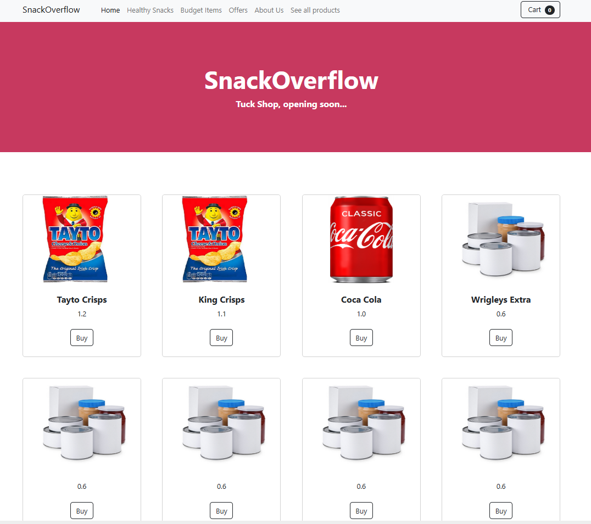
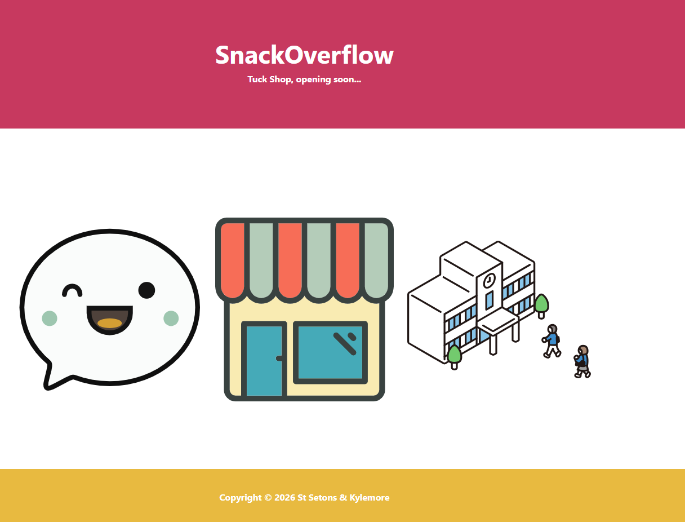
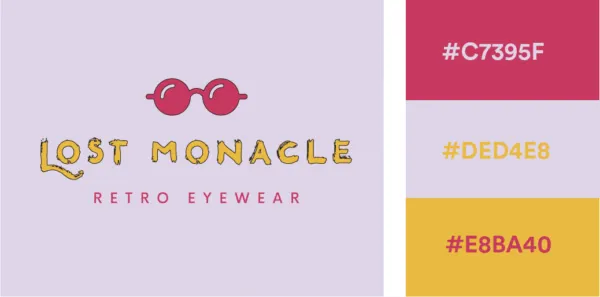

# SnackOverflow

## Tuck Shop API Demo Application for TY Students!

# Screenshot



# Screenshot 2



# Screenshot 3



# Color scheme:



# Useful Commands:s

Run app.py and start a test server:
```python -m flask run```

Run app.py and start the debug server (auto reload of changes):
```python -m flask run --debug```

Run this if you add new dependencies:
```pip freeze > requirements.txt```

Create virtual environment:
```python -m venv env```

activate environment:
```env\scripts\activate```

# Adding a product

```http://127.0.0.1:5000/addProduct```

JSON:

```
{
  "name": "Crisps",
  "product_code": 1234,
  "category": "food",
  "price": 1.2,
  "stock": 15,
  "sugar_g": 2,
  "gluten_free": true,
  "brand": "CrunchyCo"
}
```


# Useful links:

Flask Docs
https://flask.palletsprojects.com/en/stable/

Flask-tinydb’s documentation
https://flask-tinydb.readthedocs.io/

Assets
https://www.svgrepo.com/